<details class = 'info' open style = "width:1280px">
<summary>懒加载效果</summary>

<center> 

<div style = 'display:inline-block;' >
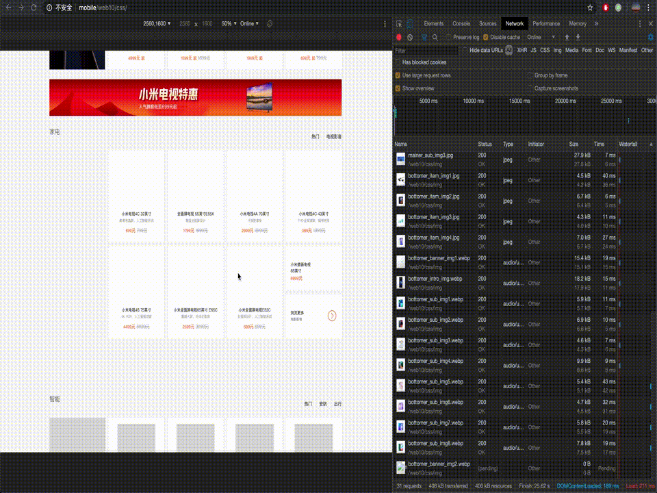 
    <br> 
    <div style="color:orange; border-bottom: 1px solid #d9d9d9;
    display: inline-block;
    color: #999;
    padding: 2px;">
	CSS背景实现
    </div>
</div>


<div style = 'display:inline-block; margin-left:20px;'>
     
    <br> 
    <div style="color:orange; border-bottom: 1px solid #d9d9d9;
    display: inline-block;
    color: #999;
    padding: 2px;">
    IMG元素实现
    </div>
</div>


</center>

<br>

- 本来是想将所有的图片压缩后作为占位符，但是因为这些图片都太小了，压缩后的效果并不明显，为了实验对比效果更加明显，所以我们使用了一张灰色的背景作为占位符。
- 可以看出 `GIF` 图中表现的效果还是比较明显的：
	- 当快速滚动下去的时候图片还没加载出来显示的是灰色的占位符。
	- 再滚上去回看的时候发现所有的图片都加载好了，符合预期。
	- 那么当用户以正常速度浏览时，等图片进入视口，图片应当就能加载出来。
- 右侧的资源文件的滚动也意味着在滚动的过程中加载了图片。

</details>


<details class = 'info' open style = "width:1280px;">
<summary>实现代码</summary>


- 在实现懒加载的过程中，除了对 `IntersectionObserver` 对象的使用, 我们发现有一步繁杂的工作是我们需要对每个 `` 标签进行批量处理。
- 这个时候就可以利用好 `JS` 的优势，在 `Chrome` 将 `HTML` 解析成 `DOM` 树之后， `JS` 可以获取每个 `` 元素，然后我们就可以对每个 `` 元素进行操作，然后在操作完之后将 `HTML` 代码以及 `CSS` 代码 `console.log()` 出来即可。


<details class = 'note' style = "">
<summary>CSS背景实现代码</summary>

```javascript
//基于jQuery
window.onload = function(){
    var allHTML = "<!DOCTYPE html>" + $('html').prop("outerHTML"); 
    var img = new Array();
    var Class = new Array();
    var width = new Array();
    var height = new Array();
    var src = new Array();
    $('img').each(function(){
        img.push($(this).prop("outerHTML"));
        Class.push($(this).attr('class'));
        width.push($(this).width());
        height.push($(this).height());
        src.push($(this).attr('src'));
    });
    var CSS = "";
    for (var i = 0; i < img.length; ++i) {
        var _CSS = ".lazy_load_" + String(i + 1) + ".visible { \n";
        _CSS += "    background-image: url(" + src[i] + ");\n";
        _CSS += "    background-size: 100% 100%;\n"
        if (width[i] !== undefined) {
            _CSS += "    width: " + String(width[i]) + "px;\n";
        }
        if (height[i] !== undefined) {
            _CSS += "    height: " + String(height[i]) + "px;\n";
        }
        _CSS += "}";
        CSS += _CSS + "\n\n";

        var _Lazy = ".lazy_load_" + this.String(i + 1) + "{ \n";
        _Lazy += "    background-image: url(img/gray.png);\n";
        _Lazy += "    background-size: 100% 100%;\n";
        if (width[i] !== undefined) {
            _Lazy += "    width: " + String(width[i]) + "px;\n";
        }
        if (height[i] !== undefined) {
            _Lazy += "    height: " + String(height[i]) + "px;\n";
        }
        _Lazy += "}";
        CSS += _Lazy + "\n\n";

        var _HTML = "<div ";
        _HTML += "class = 'lazy-background lazy_load_"+ String(i + 1)+" ";
        if (Class[i] !== undefined) {
            _HTML += String(Class[i]) + "' ";
        }else{
          _HTML += "' ";
        } 

        _HTML += "></div>"; 
        // console.log(img[i], _HTML);
        allHTML = allHTML.replace(img[i], _HTML);
    }

    var rex = new RegExp(/<script.*script>/, "g");
    allHTML = allHTML.replace(rex, "");
    allHTML += `
    <script>
		document.addEventListener("DOMContentLoaded", function(){
		var lazyBackgrounds = [].slice.call(document.querySelectorAll(".lazy-background"));
		if("IntersectionObserver" in window){
			let lazyBackgroundObserver = new IntersectionObserver(function(entries,observer){
				entries.forEach(function(entry){
				if(entry.isIntersecting){
					entry.target.classList.add("visible");
					lazyBackgroundObserver.unobserve(entry.target);
				}
				});
			});

			lazyBackgrounds.forEach(function(lazyBackground){
				lazyBackgroundObserver.observe(lazyBackground);
			});
			}
		})
	</script>
    `;
    console.log(CSS);
    console.log(allHTML);
  };
```


</details>


<details class = 'note' style = "">
<summary>IMG元素实现代码</summary>

```javascript
window.onload = function(){
    var lazyImages = [].slice.call(document.querySelectorAll("img"));
    lazyImages.forEach(function(lazyImage){
	  lazyImage.classList.add("lazy");
	  var src = lazyImage.src;
	  var srcs = src.split('/');
	  if (srcs[srcs.length - 2] === "img") {
	  	src = "img/" + srcs[srcs.length - 1];
	  }
	  lazyImage.dataset.src = src;
      lazyImage.src = "img/gray.png";
    }); 
    var allHTML = "<!DOCTYPE html>" + $('html').prop("outerHTML"); 
    var rex = new RegExp(/<script.*script>/, "g");
    allHTML = allHTML.replace(rex, "");
    allHTML += `
    <script>
    document.addEventListener("DOMContentLoaded", function() {
      var lazyImages = [].slice.call(document.querySelectorAll(".lazy"));
      if ("IntersectionObserver" in window) {
        let lazyImageObserver = new IntersectionObserver(function(entries, observer) {
          entries.forEach(function(entry) {
            if (entry.isIntersecting) {
              let lazyImage = entry.target;
              lazyImage.src = lazyImage.dataset.src;
              lazyImage.classList.remove("lazy");
              lazyImageObserver.unobserve(lazyImage);
            }
          });
        });
        lazyImages.forEach(function(lazyImage) {
          lazyImageObserver.observe(lazyImage);
        });
      }
    });
    </script>
    `;
    console.log(allHTML);
  };
```


</details>

</details>


<details class = 'info' open style = "width:1280px">
<summary>Chrome Devtools Network分析</summary>


<center> 

<div style = 'display:inline-block;' >
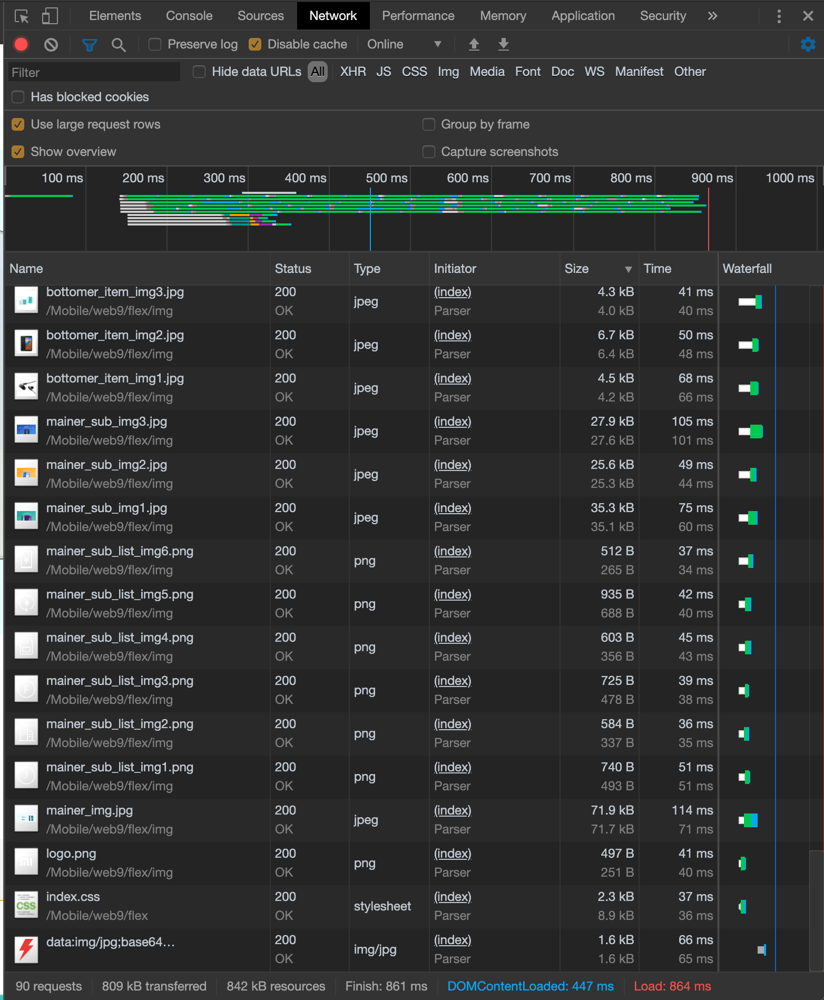 
    <br> 
    <div style="color:orange; border-bottom: 1px solid #d9d9d9;
    display: inline-block;
    color: #999;
    padding: 2px;">
	未进行懒加载优化
    </div>
</div>


<div style = 'display:inline-block; margin-left:20px;' >
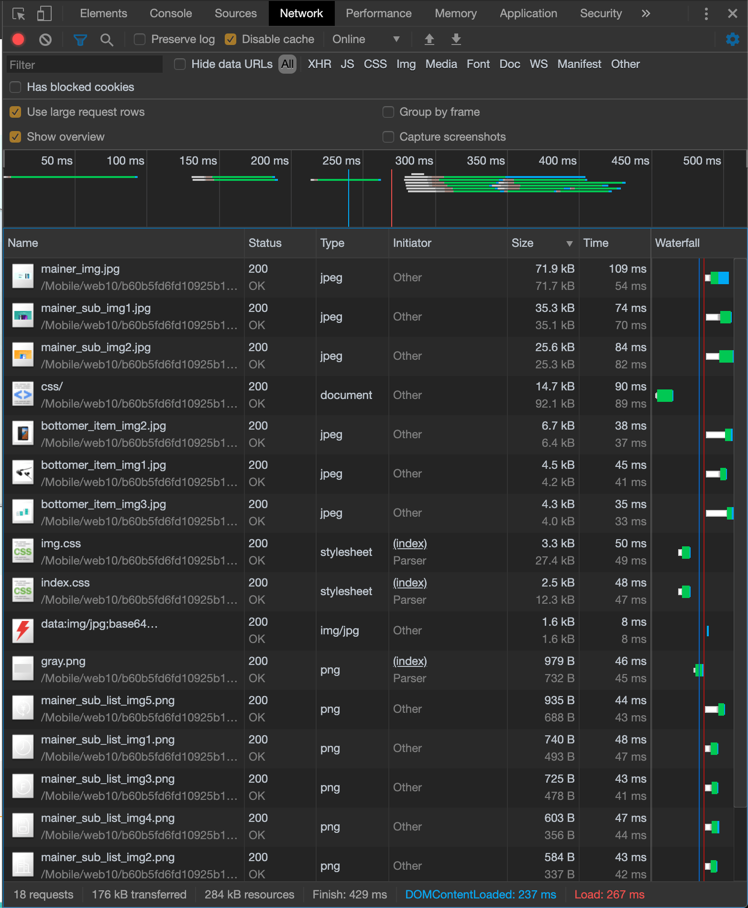 
    <br> 
    <div style="color:orange; border-bottom: 1px solid #d9d9d9;
    display: inline-block;
    color: #999;
    padding: 2px;">
	CSS背景实现
    </div>
</div>

<div style = 'display:inline-block; margin-left:20px;'>
     
    <br> 
    <div style="color:orange; border-bottom: 1px solid #d9d9d9;
    display: inline-block;
    color: #999;
    padding: 2px;">
    IMG元素实现
    </div>
</div>


</center>

<br>

|      | DOMContentLoaded | Load | resources|
| :--: | :----------------: | :----: | :----:|
|未进行懒加载优化|$447$ms|$864$ms|$842$KB|
|CSS背景实现|$237$ms|$267$ms|$284$KB|
|IMG元素实现|$208$ms|$402$ms|$264$KB|

- 从表格可以看出进行图片懒加载优化后，`DOMContentLoaded` 和 `Load` 的值都明显减少。
- 初加载时的资源文件大小也大幅减少，减少了$\frac{1}{3}$左右，这也从侧面印证了未进入视口的图片确实没有加载。
- 我们发现 `CSS背景实现` 和 `IMG元素实现` 这两种方式的 `DOMContentLoaded` 虽然没有很大差异，但是 `Load` 这个数值上差了一倍左右，应该可以说明 `CSS背景实现` 的性能要比 `IMG元素实现` 的性能要好。
 
我们再选取$10$张图片，比较它们加载时间的平均值：

|      | 1 | 2 | 3 | 4 | 5 | 6 | 7 | 8 | 9 | 10 | Average |
| :--: | :----------------: | :----: | :----:| :----:|:----:|:----:|:----:|:----:|:----:|:----:|:----:|
|CSS背景实现|$109$ms|$74$ms|$84$ms|$38$ms|$45$ms|$35$ms|$46$ms|$44$ms|$48$ms|$43$ms|$56.6$ms|
|IMG元素实现|$150$ms|$67$ms|$70$ms|$42$ms|$51$ms|$45$ms|$48$ms|$42$ms|$32$ms|$45$ms|$59.2$ms|

- 从这部分数据来看，我们也可以看出 `CSS背景实现` 的性能要比 `IMG元素实现` 的性能要好一点，但是可能图片都太小了，拉不开很大差距。


</details>

<details class = 'info' open style = 'width:1280px'>
<summary>Chrome Devtools Performance分析</summary>


<center> 

<div style = 'display:inline-block;'>
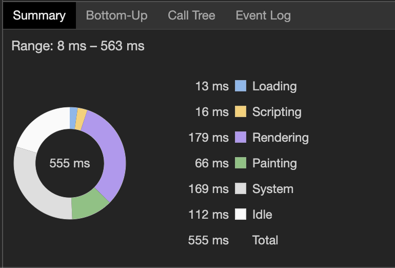 
    <br> 
    <div style="color:orange; border-bottom: 1px solid #d9d9d9;
    display: inline-block;
    color: #999;
    padding: 2px;">CSS Normal
    </div>
</div>

<div style = 'display:inline-block; margin-left:20px;'>
    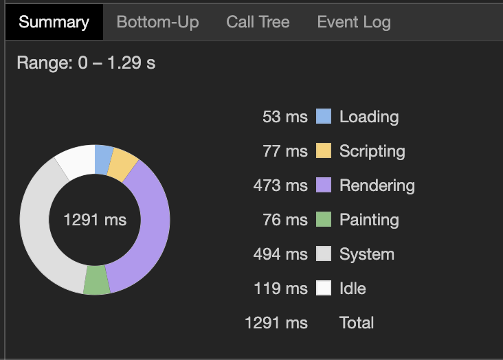 
    <br> 
    <div style="color:orange; border-bottom: 1px solid #d9d9d9;
    display: inline-block;
    color: #999;
    padding: 2px;">
    CSS 4x SlowDown
    </div>
</div>

<div style = 'display:inline-block; margin-left:20px;'>
    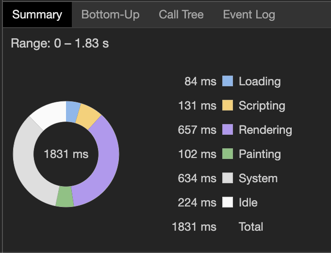 
    <br> 
    <div style="color:orange; border-bottom: 1px solid #d9d9d9;
    display: inline-block;
    color: #999;
    padding: 2px;">
    CSS 6x SlowDown
    </div>
</div>


</center>

<br>

<center> 

<div style = 'display:inline-block;'>
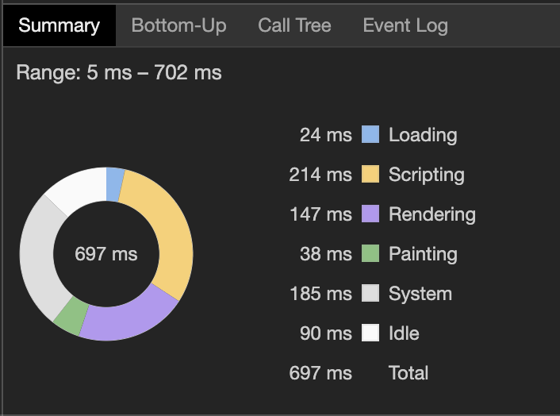 
    <br> 
    <div style="color:orange; border-bottom: 1px solid #d9d9d9;
    display: inline-block;
    color: #999;
    padding: 2px;">IMG Normal
    </div>
</div>

<div style = 'display:inline-block; margin-left:20px;'>
    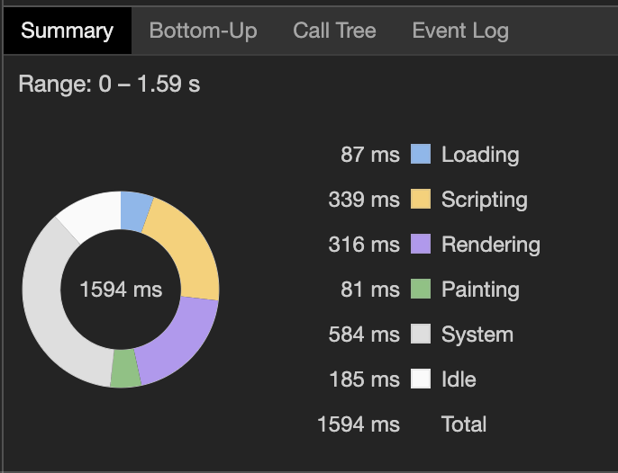 
    <br> 
    <div style="color:orange; border-bottom: 1px solid #d9d9d9;
    display: inline-block;
    color: #999;
    padding: 2px;">
    IMG 4x SlowDown
    </div>
</div>

<div style = 'display:inline-block; margin-left:20px;'>
    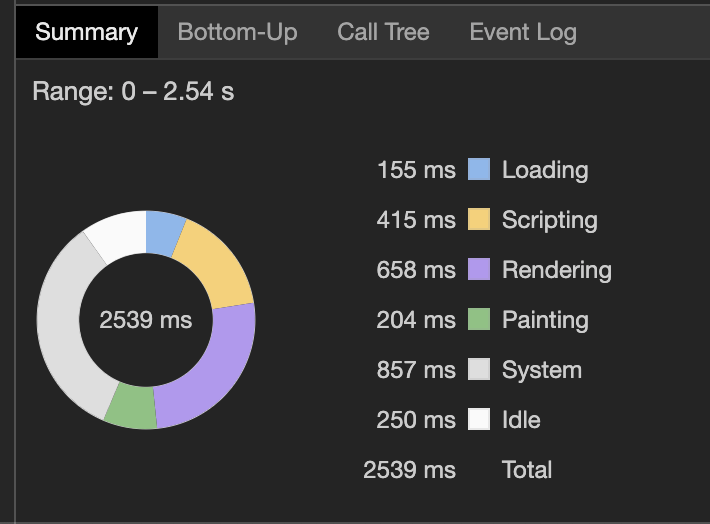 
    <br> 
    <div style="color:orange; border-bottom: 1px solid #d9d9d9;
    display: inline-block;
    color: #999;
    padding: 2px;">
    IMG 6x SlowDown
    </div>
</div>


</center>

<br>

<center> 

<div style = 'display:inline-block;'>
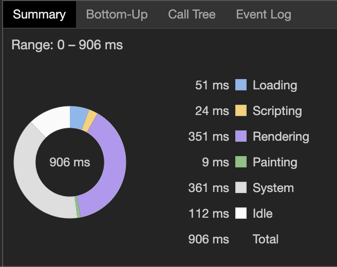 
    <br> 
    <div style="color:orange; border-bottom: 1px solid #d9d9d9;
    display: inline-block;
    color: #999;
    padding: 2px;">未优化 Normal
    </div>
</div>

<div style = 'display:inline-block; margin-left:20px;'>
    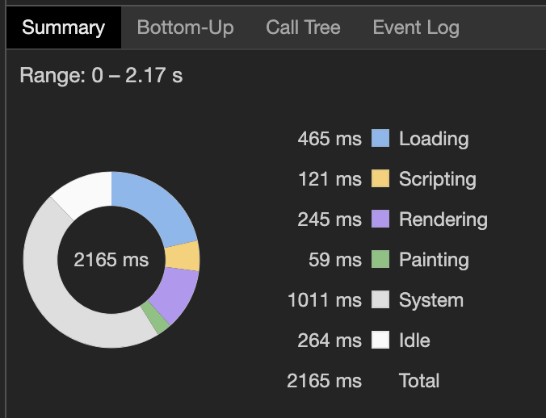 
    <br> 
    <div style="color:orange; border-bottom: 1px solid #d9d9d9;
    display: inline-block;
    color: #999;
    padding: 2px;">
    未优化 4x SlowDown
    </div>
</div>

<div style = 'display:inline-block; margin-left:20px;'>
    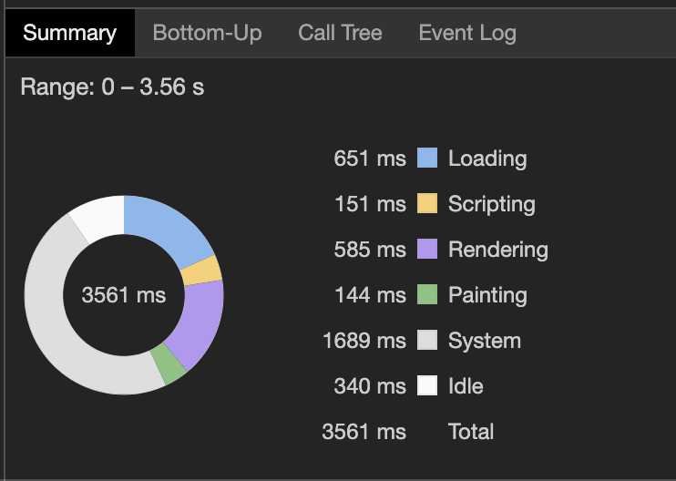 
    <br> 
    <div style="color:orange; border-bottom: 1px solid #d9d9d9;
    display: inline-block;
    color: #999;
    padding: 2px;">
    未优化 6x SlowDown
    </div>
</div>


</center>

<br>

- 我们在对比中通过 `Chrome` 进行放慢 `CPU` 速度，放大实验结果, 来实现横向对比：
	- `CSS`背景实现方式中，纵然我们放慢了`CPU`速度，只有 `Rendering` 耗时明显增加了，其它耗时基本不变。
	- `IMG`元素实现方式中，`Scripting` 和 `Rendering` 两项耗时有明显增加，其它耗时基本不变。
- 通过引入 `未优化` 时的数据，进行纵向对比：
	- 我们发现 `未优化` 时 `Scripting` 的时间占用并不多，基本和 `CSS` 背景实现方式持平。
	- 那么 `IMG` 元素实现方式确实增加了 `Scripting` 的耗时，带来了性能损耗。
- 那么在这项分析中，其实我们可以得出 `IMG` 元素实现方式的性能是不如 `CSS` 背景实现方式的结论。


</details>

<details class = 'info' open style = "width:1280px;">
<summary>滚动对比</summary>

我们发现 `Chrome Devtools Network` 中有一项数值是 `Finish`， 它在页面的 `Load` 完之后如果有资源动态加载进来，该项数值会继续增加，那么我们采用如下方式进行实验：
- 通过 `Ctrl + R` 刷新页面后，在触摸板中手指向下滑动(力度尽量均匀)，让页面自然往下滚动直至页尾，停止后取 `Finish` 值作为结果。
- 为尽量减小误差，采用对每种实现方式各采集$5$次数值然后取平均值进行对比。

|      | 1 | 2 | 3| 4 | 5 | Average |
| :--: | :----------------: | :----: | :----:| :----: | :----: | :----: |
|CSS背景实现|$1.30$s|$1.05$s|$1.22$s|$1.39$s|$1.09$s|$1.21$s|
|IMG元素实现|$1.32$s|$1.26$s|$1.11$s|$1.13$s|$1.29$s|$1.22$s|

- 其实从这项数据中可以看出两者的差距并不是很大。
- 但其实这并不能说明什么，因为参与实验的页面上的图片都是很轻量级的，基本上图片进入视口就加载出来了，这个时间基本上就是页面往下滚动的时间，两者时间差不多，顶多说明我的手比较稳，每次的力度差不多，只是页面的滚动时间差不多罢了。

</details>


